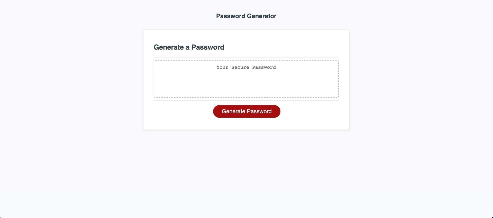

# 03 JavaScript: Password Generator

## Description
My motivation for making this page was to practice my javascript skills I learned including working with functions, different variable types and even the WebAPI. Also, it helped me to work on general programming concepts like the agile method and decomposing a problem into smaller, more manageable bits. 

I also will be adding this to my portfolio from assignment 2. I'm looking forward to continue to learn more about the WebAPI so I can make even more powerful webpages. 

## Deployment
<a href="https://john-abou.github.io/module3-johns-digital-bank/">Webpage link</a>

## Usage
The webpage has been made for anyone to be able to generate a random password. The user simply clicks on the button, decides the length of the password and what character types they'd like to have included. (lowercase, uppercase, numbers, special characters). After they've entered that information, the webpage will generate a password for them.

### Desktop webpage screenshot

### Mobile webpage screenshot

## Credits
Shoot out to my tutor Andres who helped me understand decomposing the problem and tackling it piece by piece. He also helped me understand how JS works in regards to building functions, returning variable to reuse later, etc.

## License
This webpage has been made commercially available under the MIT license.

- - -
© Copyright. john-abou. The one piece is real 🏴‍☠
